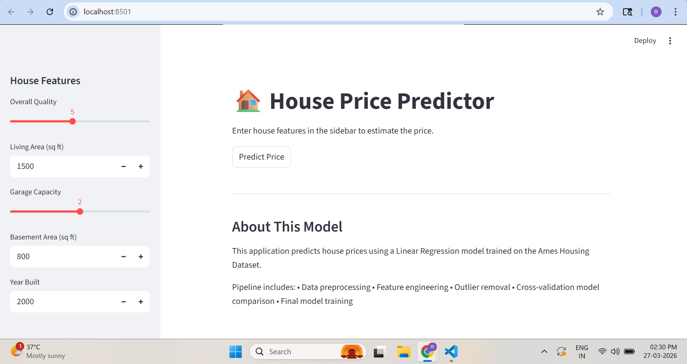

# 🏠 House Price Prediction – End-to-End Machine Learning Project

This project builds a **complete machine learning pipeline** to predict house prices using the **Ames Housing Dataset**.

It demonstrates a full **end-to-end ML workflow**, including:

* Data exploration
* Data preprocessing
* Feature engineering
* Model comparison
* Final model training
* Prediction pipeline
* Deployment using a **Streamlit web application**

The goal is to estimate the **sale price of a house based on property features** such as living area, overall quality, basement size, garage capacity, and more.

---

## App Preview



# 📊 Project Overview

House price prediction is a classic **regression problem in machine learning**.

This project follows real-world ML development practices:

* Exploratory Data Analysis (EDA)
* Data cleaning and preprocessing
* Feature engineering
* Model comparison using cross-validation
* Final model training
* Building a prediction pipeline
* Deploying the model with Streamlit

The final result is an **interactive application that predicts house prices instantly**.

---

# ⚙️ Machine Learning Pipeline

The project follows this workflow:

EDA
↓
Data Preprocessing
↓
Feature Engineering
↓
Model Comparison
↓
Final Model Training
↓
Prediction Pipeline
↓
Streamlit Web Application

---

# 🧠 Models Evaluated

The following models were evaluated using **5-fold cross-validation**:

* Linear Regression
* Random Forest Regressor
* Gradient Boosting Regressor

Model performance was compared using **Root Mean Squared Error (RMSE)**.

**Final Model Used:** Linear Regression

---

# 📈 Features Used

The model uses several important house characteristics such as:

* Overall quality of the house
* Living area (square feet)
* Basement size
* Garage capacity
* Year built

Additional **engineered features** were created to improve performance:

* HouseAge
* GarageAge
* RemodAge
* TotalSF
* TotalBathrooms
* TotalPorchSF

Feature engineering significantly improved the model’s predictive power.

---

# ⚡ Quick Start

Follow these steps to run the project locally.

## 1️⃣ Clone the repository

https://github.com/rahul-ml-engineer/house-price-prediction-ml

git clone https://github.com/rahul-ml-engineer/house-price-prediction-ml.git

cd house-price-prediction-ml

## 2️⃣ Create a virtual environment

python -m venv .venv

## 3️⃣ Activate the environment

Windows:

.venv\Scripts\activate

Mac / Linux:

source .venv/bin/activate

## 4️⃣ Install dependencies

pip install -r requirements.txt

## 5️⃣ Train the model

python src/train_model.py

## 6️⃣ Run the Streamlit application

streamlit run app/app.py

The application will open in your browser at:

http://localhost:8501

---

# 🖥 Streamlit Web Application

The Streamlit interface allows users to **input house features and get an estimated price instantly**.

Example inputs include:

* Overall Quality
* Living Area
* Basement Area
* Garage Capacity
* Year Built

The application then predicts the **estimated market value of the property**.

---

# 🗂 Project Structure

```
house-price-prediction-ml
│
├── app
│   └── app.py
│        Streamlit web application
│
├── data
│   └── raw
│       ├── train.csv
│       └── test.csv
│
├── models
│   └── house_price_model.pkl
│
├── notebooks
│   └── eda.ipynb
│
├── src
│   ├── config.py
│   ├── preprocess.py
│   ├── feature_engineering.py
│   ├── model_comparison.py
│   ├── train_model.py
│   └── predict.py
│
├── requirements.txt
├── LICENSE
└── README.md
```

---

# 📚 Dataset

Dataset used:

**Ames Housing Dataset**

This dataset contains detailed information about residential homes in **Ames, Iowa**, and is widely used for machine learning regression problems.

---

# 🛠 Technologies Used

* Python
* Pandas
* NumPy
* Scikit-learn
* Streamlit
* Joblib
* Matplotlib / Seaborn

---

# 📌 Key Learnings

This project demonstrates:

* Building an end-to-end machine learning pipeline
* Handling missing values and outliers
* Creating engineered features for better predictions
* Comparing models using cross-validation
* Deploying machine learning models with Streamlit

---

# 👤 Author

Machine learning project built for **portfolio and freelancing demonstration**.

---

# ⭐ Future Improvements

Possible enhancements include:

* Hyperparameter tuning
* Adding advanced models (XGBoost / LightGBM)
* Cloud deployment (Streamlit Cloud or AWS)
* Expanding the web interface with more features
